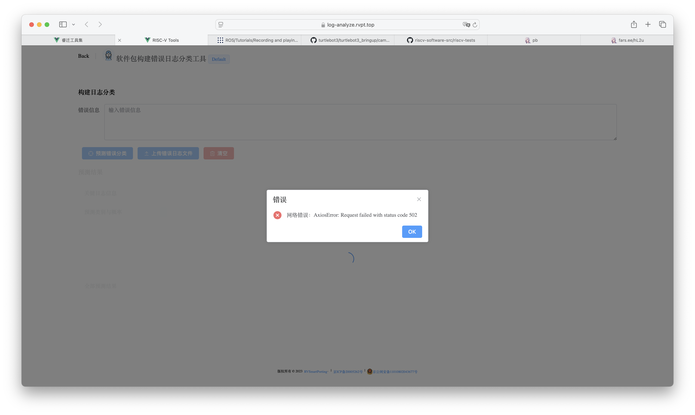
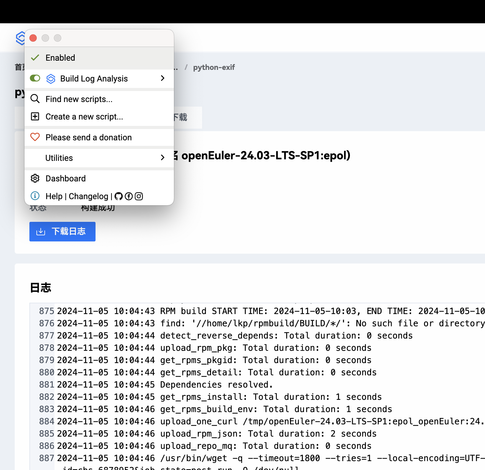

# RISmartPorting 调研报告

## 工具集（是什么）

睿迁工具集旨在帮助开发者快速的识别以及分类软件包中的构建错误的特定信息，帮助开发者更加高效的解决问题。

睿迁工具集主要是分为以下几个工具：

- 软件包构建日志分析工具 -> 网站上已支持
- 缺陷报告指令集架构分类工具-> 网站上已支持
- RISC-V 架构适配知识库-> 网站上已支持
- 目标代码定位工具 -> 网站上未支持
- 软件打包配置智能修改辅助工具 -> 网站上未支持
- 扩展指令函数转换工具 -> 网站上未支持
- 跨架构代码变更同步工具 -> 网站上未支持
- 迁移任务规划工具 -> 网站上未支持

## 工具集特性

## 软件包构建日志分析工具

目前网页版不可用：AxiosError: Request failed with status code 502

网页脚本无法使用，环境：

- Arc：Version 1.69.0 (55816)
- Tempermonkey：v5.3.2

-> 根据以上问题提交了 [issue](https://gitee.com/rvsmart-porting/root-cause-analysis/issues/IB53I1)